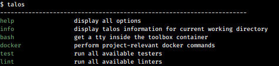

talos
=====

[](https://circleci.com/gh/pemcconnell/talos/tree/master)

build, test and run framework

The mission of this tool is to provide a widely compatable script which can
aide in the development and testing of software projects. The idea is to bundle
up common pre-production tooling into a docker image (which we call a toolbox)
so that all developers can quickly test against their code using the same
features used in CI.




install
-------

```sh
# read the contents of this file before running it
# you may want to skip this step after reading it and install manually
sh install.sh
```

commands
--------

```sh
talos
----------------------------------------------------------------------
help                 display all options
info                 display talos information for current working directory
lint                 run all available linters
test                 run all tests associated with this repo
docker               perform project-relevant docker commands
```

customise and extend
--------------------

One of the core principles of Talos is to allow the user to customise and
extend it's functionality. To do this, create a `.talos` folder *in your
project root* to place your desired customisations.

### custom configuration

One of the main ways to define customisations is with a `config.sh` file placed
into a `.talos` directory of your project root. Here you can set
project-specific configurations for your project. For example:

`.talos/config.sh`
```sh
#!/usr/bin/env sh
# shellcheck disable=SC2034

set -e


# just some custom hash example - all of this is totally up to your needs
hash() {
  if command -v md5 > /dev/null; then
    find "$1" -type f -and -not -path "./.git/*" -exec md5 -q {} \; | md5
  elif command -v md5sum > /dev/null; then
    find "$1" -type f -and -not -path "./.git/*" -exec md5sum {} \; | awk '{ print $1 }' | md5sum | awk '{ print $1 }'
  else
    >&2 echo "[error] failed to hash. no md5 or md5sum found"
    exit 1
  fi
}

TALOS_IMAGE=mycustomtoolbox:0.1
# DOCKER_COMPOSE_FILE=
DOCKER_TAG="myproject:$(hash "$PROJECT_ROOT")"
# DOCKER_FILE=
# DOCKER_CONTEXT=
# DOCKER_PROGRESS=
# HOME_DIR=
```

This file will be automatically picked up and when you run `talos docker build`
given the config.sh file above it will build your project as the image
"myproject" and a tag generated from an md5 hash of your files.

### custom functions

Adding custom functions to Talos is trivial. Place a shell file into your
projects `.talos/cmds/` directory with the filename to match the desired
command. In that file you should place a comment starting `# help: ` under the
shebang indicating the help text you wish to display. For example, lets say
we wanted a "frog" function, we would add:

`./.talos/cmds/frog.sh`
```sh
#!/usr/bin/env sh
# help: ribbit im a frog

echo "ribbit! ...ribbit!"
```

Then when we run `talos` we can see our new command listed:

```sh
talos
----------------------------------------------------------------------
help                 display all options
info                 display talos information for current working directory
lint                 run all available linters
test                 run all tests associated with this repo
docker               perform project-relevant docker commands
frog                 ribbit im a frog
```

Now when we run `talos frog` we get to see our wonderful script in action:

```sh
talos frog
ribbit! ...ribbit!
```

Now if we wanted to add some custom flags to our frog function we can add
them to the help description with an `# flags:` section like so:

```sh
#!/usr/bin/env sh
# help: ribbit im a frog
# flags:
# --jump | optional. tells our frog to jump
# --croak | optional. tells our frog to croak

if [ "$FLAG_croak" = "True" ]; then
  echo "ribbit! ...ribbit!"
fi
if [ "$FLAG_jump" = "True" ]; then
  echo "...jump!"
fi
```

With our updated file we can make use of our new flags:

```sh
# our flags are now visible in the help section
$ talos frog --help
talos frog
  --help             get all available help options
  --jump             optional. tells our frog to jump
  --croak            optional. tells our frog to croak

# and they're ready to use
$ talos frog --jump --croak
ribbit! ...ribbit!
...jump!
```

If our custom file has a main() method defined it will be executed by default
when the command is requested. For example, with new new main() method:

```sh
#!/usr/bin/env sh
# help: ribbit im a frog
# flags:
# --jump | optional. tells our frog to jump
# --croak | optional. tells our frog to croak

if [ "$FLAG_croak" = "True" ]; then
  echo "ribbit! ...ribbit!"
fi
if [ "$FLAG_jump" = "True" ]; then
  echo "...jump!"
fi

main() {
  echo "im fired automatically"
}
```

When we fire the previous command we now get:

```sh
$ talos frog --jump --croak
ribbit! ...ribbit!
...jump!
im fired automatically
```

__note:__ all logic should be contained within the main() method - in the
example above we handle flags outside of main(). This makes the script less
friendly to being included from other scripts. The above was just for example
purposes


### custom toolbox image

Want to use a handrolled docker image for running all of your linting / testing
etc in? Great. Set `TALOS_IMAGE=yourimage:0.1` in your `.talos/config.sh`. The
only requirement is that `talos` is installed in your image. The default image
is pemcconnell/talos:latest and it's found in ./toolboxes/Dockerfile.python in
this repo.

### overriding functions

Using the same approach that we took for custom functions, we can overwrite
core commands in the same way. For example, lets say that we want to change
`talos lint` so that it prints "lgtm" every time someone runs it, we create
a file in our project at `./.talos/cmds/lint.sh`:

```sh
#!/usr/bin/env sh
# help: linting made easy

echo "lgtm"
```

Now when you run `talos` you will see the core `lint` command has been replaced
by the custom one that we have created:

```sh
talos
----------------------------------------------------------------------
help                 display all options
info                 display talos information for current working directory
frog                 ribbit im a frog
lint                 linting made easy
test                 run all tests associated with this repo
docker               perform project-relevant docker commands
```

When we run `talos lint` we see our script has been executed:

```sh
talos lint
lgtm
```

command flags
-------------

You can get access to long flags (talos commmand --something --else=xx) for
free. These are interpreted in talos.sh and eval'ed to FLAG_$name. Where a
value is not declared, True is set. For example:

```sh
talos docker build --tag=pemcconnell/talos:latest
# variable $FLAG_tag equals pemcconnell/talos:latest

talos docker build --foo
# variable $FLAG_foo equals True
```

core commands
-------------

### linting

Running `talos lint` will run the linter against your current working
directory. An example with some errors:

```sh
talos lint
 linting ...
 - checking for shell/bash
 [ info      ] checking ./install.sh
 [ info      ] checking ./cmds/lint.sh
 [ info      ] checking ./cmds/test.sh
 [ info      ] checking ./cmds/docker.sh
 [ info      ] checking ./talos.sh

In ./talos.sh line 63:
        if echo "$cmdcache" | egrep -q "@$name@"; then
                              ^---^ SC2196: egrep is non-standard and deprecated. Use grep -E instead.

For more information:
  https://www.shellcheck.net/wiki/SC2196 -- egrep is non-standard and depreca...
 [ info      ] checking ./.talos/config.sh
 - checking for docker
 [ info      ] checking ./Dockerfile
./Dockerfile:9 DL3008 Pin versions in apt get install. Instead of `apt-get install <package>` use `apt-get install <package>=<version>`
./Dockerfile:9 DL3009 Delete the apt-get lists after installing something
./Dockerfile:9 DL3015 Avoid additional packages by specifying `--no-install-recommends`
 - checking for python
 [ info      ] no python found. skipping
```

### testing

Running `talos test` will run the tester against your current working directory.
An example running pytest using packages provided by a pipenv file:

```sh
talos test --pipenvdev
talos test --pipenvdev
 testing ...
 - checking for shell/bash
 [ info      ] no shell/bash found. skipping
 - checking for python
 [ info      ] python (pytest)
 [ info      ] running pytest .
Creating a virtualenv for this project…
Pipfile: /home/someone/go/src/github.com/pemcconnell/something...
Using /usr/bin/python3.7m (3.7.3) to create virtualenv...
⠏ Creating virtual environment...created virtual environment CPython3.7.3.final.0-64 in 634ms
  creator CPython3Posix(dest=/root/.local/share/virtualenvs/something-f_WkJjmG, clear=False, global=False)
  seeder FromAppData(download=False, pip=bundle, setuptools=bundle, wheel=bundle, via=copy, app_data_dir=/root/.local/share/virtualenv)
    added seed packages: pip==20.1.1, setuptools==49.1.0, wheel==0.34.2
  activators BashActivator,CShellActivator,FishActivator,PowerShellActivator,PythonActivator,XonshActivator

✔ Successfully created virtual environment!
Virtualenv location: /root/.local/share/virtualenvs/something-f_WkJjmG
Installing dependencies from Pipfile.lock (0bd995)…
  🐍   ▉▉▉▉▉▉▉▉▉▉▉▉▉▉▉▉▉▉▉▉▉▉▉▉▉▉▉▉▉▉▉▉ 67/67 — 00:00:38
To activate this project's virtualenv, run pipenv shell.
Alternatively, run a command inside the virtualenv with pipenv run.
================================ test session starts =================================
platform linux -- Python 3.7.3, pytest-5.3.1, py-1.9.0, pluggy-0.13.1
rootdir: /home/someone/go/src/github.com/pemcconnell/something
plugins: aiohttp-0.4.1, cov-2.7.1
collected 4 items

tests/test_something.py .........                                               [100%]

================================= 4 passed in 0.21s ==================================
```

### docker build

To build with docker you can run `talos docker build`. This will attempt to autodetect if it is a docker-compose or Dockerfile build. If Dockerfile, it will attempt to detect if it is a buildkit image. An example (buildkit):

```sh
 ± talos docker build
#2 [internal] load .dockerignore
#2 transferring context: 2B done
#2 ...

#1 [internal] load build definition from Dockerfile
#1 transferring dockerfile: 3.10kB done
#1 DONE 0.7s
...
#18 exporting layers
#18 exporting layers 1.3s done
#18 writing image sha256:b7e247239e19114e71108899e598748300decb93f40020377a28b352ac8853aa done
#18 naming to docker.io/library/talos:40bd09002595f8ccda7d42c168ebdd0c done
#18 DONE 1.3s
```

### docker run

Once the image has been built you can run the container using `talos docker run`. This will automatically mount in a series of common volumes. For convenience this generated 'docker run' command is pasted prior to running the container so you can easily copy/paste it and tweak as required:

```sh
 talos docker run
 [ info      ] running docker run --rm  -e DISPLAY=unix/private/tmp/com.apple.launchd.WJTehPPKq2/org.macosforge.xquartz:0 -e HOST_HOME=/Users/someguy -ti talos:05b8266beeaaf11979f6ef888ad40db5
root@de84379554b6:/#
```
